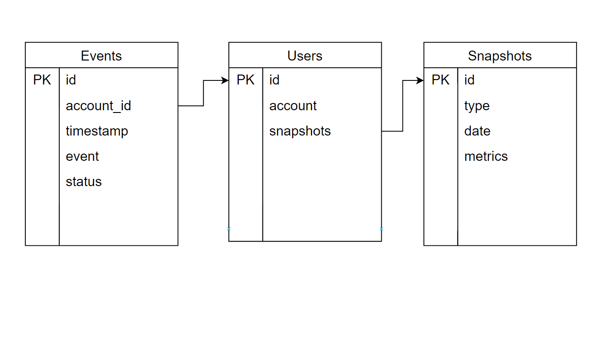

# Модель данных

Ожидается, что данные о метриках будут хранится у пользователя на почте, тем самым сама система не ответственна за данные.
Для индексации и поиске метрик будет использоваться сущность Snapshots.

Все входящие эвенты будут хранится в представлении Events.
Все зарегистрированные пользователи будут храниться в представлении Users.

