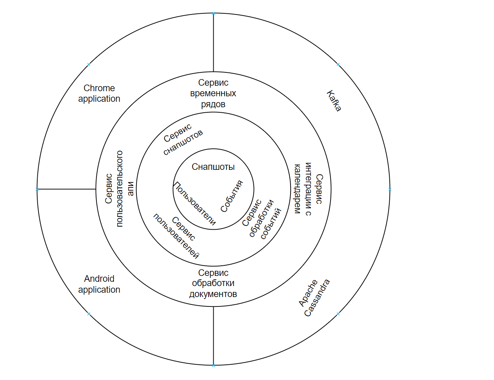

# Описание выбора архитектуры

Рассматривания модель данных можно увидеть всего три сущности:
- Эвенты, которые описывают входящие события, для них удобно использовать потокую запись и чтение
- Пользователи
- Мета данные метрик из документов

Данные схема не требует использования композиции запросов, тем самым для данных сущностей не требуется реляционная БД.
В данном достаточно любой БД позволяющий фильтрацию по полям и не требуется кластер. Кассандра позволяет делать фильтрацию через создание индекса по полям.

