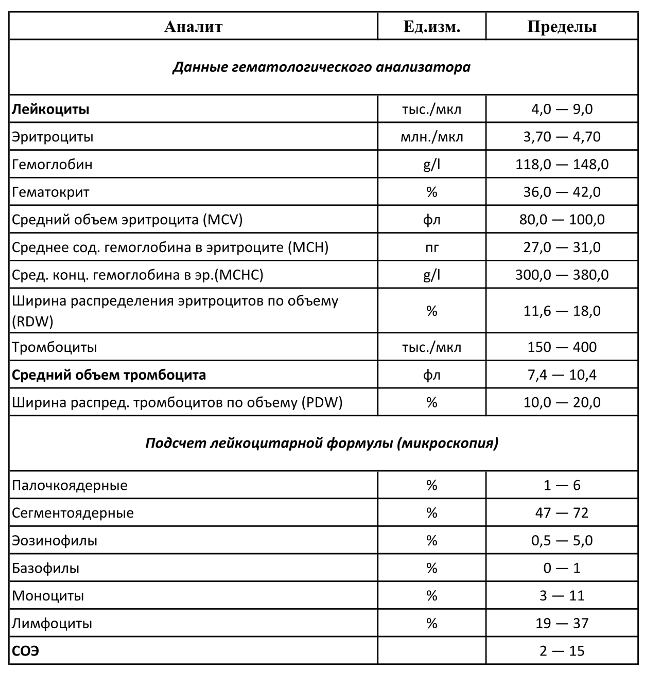
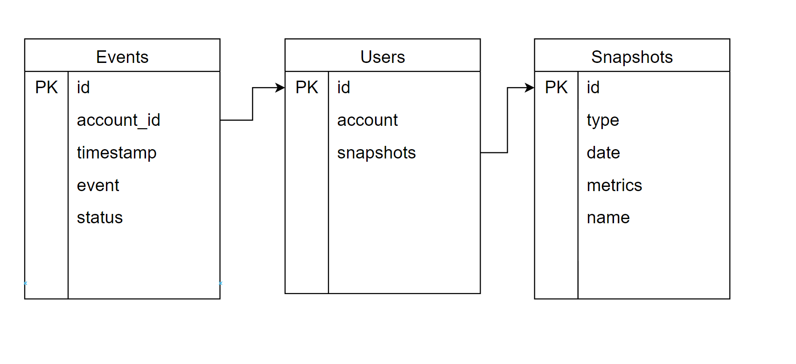

# API

## Функции (эндпониты)

CRUDS(Удаление не предусмотренно)

- Загрузка/замена документа будет происходить одним методом
- Просмотр документа
- Просмотр метрик

### Загрузка документа

```http

POST /snapshots/new
Cookies: account=..
Content-type: application/pdf
{
    "name" : ""
    "type" : "",
    "date" : ""
}

FILE.pdf
```

### Просмотр метрик

```http 
Просмотр документ
GET /metrics/all

GET /metrics/visualize?date=11.03.2014&filters=str

```

### Работа пользователя

Пока эту часть не планируется реализовывать
#### Регистрация пользователя
#### Авторизация пользователя

# Пример входящих данных




## Описание сущности ad

Ожидается, что данные о метриках будут хранится у пользователя на почте, тем самым сама система не ответственна за данные.
Для индексации и поиске метрик будет использоваться сущность Snapshots.

Все входящие эвенты будут хранится в представлении Events.
Все зарегистрированные пользователи будут храниться в представлении Users.



### Описание 

### Описание сущности Snapshot(Снапшот)

1. Идентификатор
2. Название снапшота
2. Тип снапшота (общий анализ крови, химия крови и т.д.)
3. Дата (в какой дате будут сохранены данные)
4. Метрики(список метрик, данные которых будут в данном снапшоте в календаре)

**Пример данных сохраняемых в календарь**
Наименование события id:
```json
{
	"id" : 1,
	"name" : "medsi_lab_20220304",
	"type" : "лаборатория",
	"data" : {
		"x1" : 333,
		"x2" : 332,
		"x3" : 55.5
	}

}
```

### Описание сущности User(пользователь)

1. Идентификатор
2. google Аккаунт
3. лист со снапшотами данного пользователя

### Описание сущности Event(события) 

Это техническая сущность для анализа входящих запросов.

1. Идентификатор
2. Айди аккуанта
3. Время эвента
4. Наименование эвента
5. Статус
