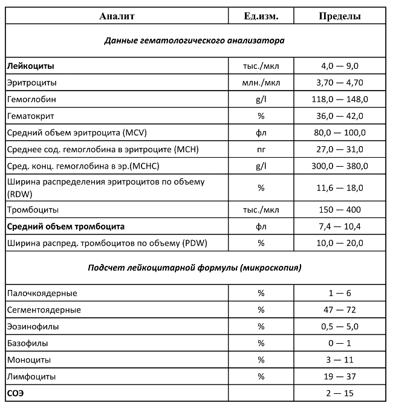
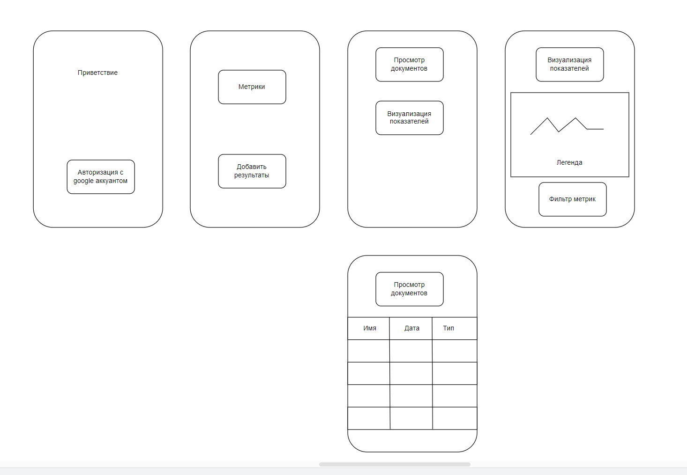

# Описание API

## Работа пользователя

```http
POST /users/register
{
    "google_account" : asdas@gmail.com
}

POST /users/authentication
```

## Загрузка документа

```http

POST /snapshots/new
Cookies: account=..
Content-type: application/pdf
{
    "name" : ""
    "type" : "",
    "date" : ""
}

FILE.pdf
```

## Просмотр метрик

```http 
Просмотр документ
GET /metrics/all

GET /metrics/visualize?date=11.03.2014&filters=str

```

# Пример входящих данных



# UI мобильного приложения


